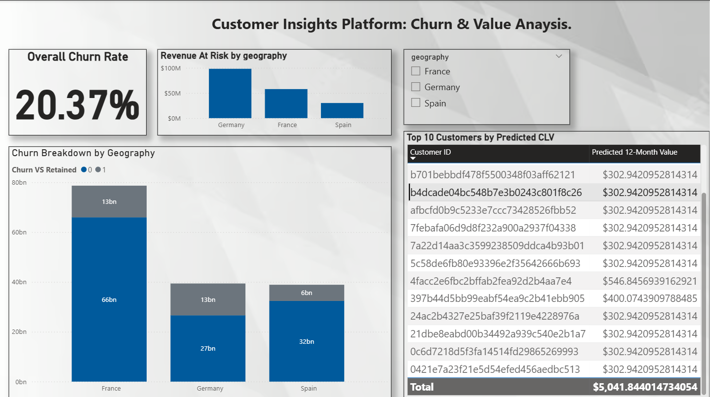

# Customer Insights Platform: An End-to-End Analytics & AI Project


**An end-to-end data science project demonstrating the full lifecycle from raw data ingestion and cloud ELT to a deployed machine learning application and an executive-level BI dashboard.**

---

## 🚀 Live Demonstrations

This project is fully deployed and publicly accessible.

* **Live Web Application (Deployed on Render):**
    [https://customer-insights-platform.onrender.com/](https://customer-insights-platform.onrender.com/)

* **Interactive Power BI Dashboard (Video Demo):**
    [https://www.loom.com/share/b2277892616d41af970e59f51619e7fb](https://www.loom.com/share/b2277892616d41af970e59f51619e7fb)

---

## 1. Executive Summary: Business Impact & Solution

This project was developed to solve two of the most critical challenges in customer-facing businesses: **customer retention** and **revenue optimization**. The resulting platform provides a unified solution for data-driven decision-making by answering two key questions:

1.  **Which customers are at risk of churning?** By leveraging a tuned XGBoost classification model, the platform provides a real-time risk assessment, enabling the business to move from a reactive to a **proactive retention strategy**.
2.  **Which customers will be the most valuable?** By applying probabilistic Customer Lifetime Value (CLV) models, the platform forecasts future customer value, allowing for **optimized marketing spend** and strategic resource allocation towards high-potential customer segments.

This end-to-end project demonstrates a comprehensive skill set in data engineering, machine learning, and business intelligence, culminating in tangible, actionable insights.

## 2. Key Technical Achievements & Skills Demonstrated

* **End-to-End ELT Pipeline:** Engineered a robust, automated pipeline using Python and SQL to extract data from raw CSVs, load it into a cloud-hosted PostgreSQL database (**Neon.tech**), and run SQL-based transformations to create clean, analytics-ready production tables.
* **Cloud Database Integration:** Successfully integrated a live, cloud-based PostgreSQL database, demonstrating proficiency in modern data infrastructure and moving beyond `localhost` development.
* **Machine Learning Model Deployment:** Deployed a tuned XGBoost model as a live web application using **Flask** and **Gunicorn**, serving predictions via a user-friendly interface. This showcases the ability to move a model from a notebook environment to a production-ready state.
* **Hyperparameter Tuning & Business Logic:** The prediction model was not only trained but tuned for performance. Crucially, a dynamic prediction threshold was implemented in the application logic, demonstrating a deep understanding of how to translate a model's probabilistic output into a practical business decision tool.
* **Advanced CLV Modeling:** Implemented industry-standard probabilistic models (`BetaGeoFitter` and `GammaGammaFitter`) from the `Lifetimes` library to accurately forecast customer value on a large, real-world e-commerce dataset.
* **Interactive BI Visualization:** Developed a polished, executive-level dashboard in **Power BI** with interactive slicers and drill-down capabilities, proving the ability to communicate complex data insights to non-technical stakeholders.

## 3. System Architecture & Data Flow

`[Raw CSV Files]` -> `[Python (Pandas)]` -> **LOAD** -> `[PostgreSQL Staging Tables (Neon)]` -> **TRANSFORM (SQL)** -> `[Clean Production Tables]`

The clean data then feeds two parallel workflows:

* **ML Operations (MLOps) Workflow:** `[Jupyter Notebook]` -> `[Model Training & Tuning (XGBoost)]` -> `[Serialized Model Artifact (.joblib)]` -> `[Flask API & Web App (Render)]`
* **Business Intelligence (BI) Workflow:** `[Power BI]` -> `[Data Modeling]` -> `[Interactive Dashboard]`

## 4. Showcase

### Live Web Application - Real-Time Churn Prediction


*The deployed Flask application, providing instant, real-time churn risk assessment via a clean user interface.*

### Executive Power BI Dashboard


*The final Power BI dashboard, visualizing key churn drivers and customer value for strategic decision-making.*

---

## 5. How to Run Locally

To clone and run this project on your local machine, please follow these steps:

1.  **Clone the repository:**
    ```bash
    git clone [https://github.com/Shubham812004/customer-insights-platform.git](https://github.com/Shubham812004/customer-insights-platform.git)
    cd customer_360_large
    ```
2.  **Set up a Python virtual environment:**
    ```bash
    python -m venv venv
    source venv/bin/activate  # On Windows, use `.\venv\Scripts\activate`
    ```
3.  **Install the required dependencies:**
    ```bash
    pip install -r requirements.txt
    ```
4.  **Run the Flask application:**
    ```bash
    cd app
    flask run
    ```
5.  Open your browser and navigate to `http://127.0.0.1:5000`.